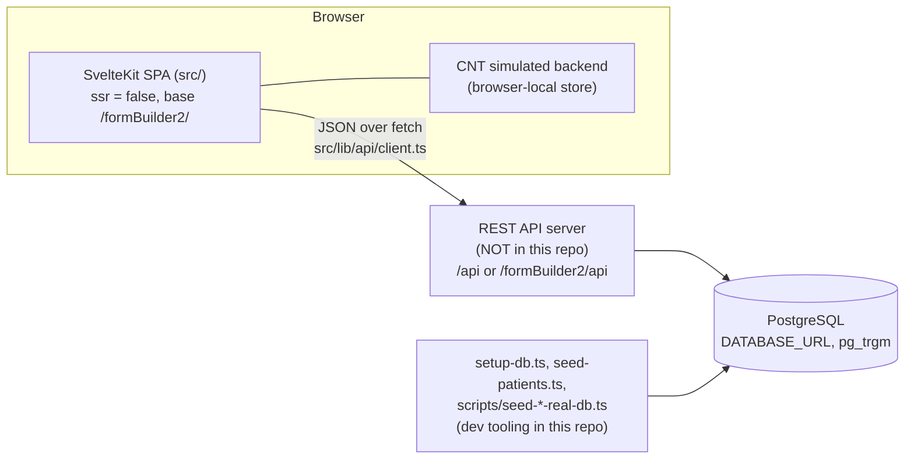

<!-- living-spec -->
Status: living
Last-updated: 2026-07-15
Source-of-truth: code
Verified-against: 637f03a
Owns: the system context, frontend architecture, module ownership map, the route ↔ engine matrix, and build/deployment facts.

# spec/02 — Architecture

## System context

- The app is a **pure client SPA**: no `+server.ts`, `+page.server.ts`, `hooks.server.ts`, or `src/lib/server/` exists. All persistence goes through the external REST API ([spec/07](07-rest-api-and-data-model.md)).
- The REST **server implementation is not in this repo**; only the client bindings, the API contract, and the PostgreSQL setup/seed scripts are.
- CNT runs against a **browser-local simulated backend** ([spec/08](08-case-note-tracker.md)); its future server contract is specified in spec/07.

## Frontend architecture

- **Framework**: SvelteKit with Svelte 5 runes. `src/routes/+layout.ts` sets `export const ssr = false`, making every page client-rendered. `src/app.html` is the shell (`lang="en-GB"`, `data-sveltekit-preload-data="hover"`).
- **Base path**: the app is hosted under `/formBuilder2/`; all internal links prepend `base` from `$app/paths`. `src/lib/api/client.ts` picks the API base: `/api` on the dev port 3210, `/formBuilder2/api` under the deployed base path, overridable via `VITE_API_BASE_URL`.
- **Routing**: file-based under `src/routes/`. Query-string parameters (`patientUuid`, `formUuid`, `formVersion`, `openInRoV`, `readOnlyBackOnly`, `username`) drive form loading in each route's `+page.ts`.
- **State**: Svelte 5 runes local to components (`$state`, `$derived`, `$props`); no global store library. Exceptions: `src/lib/caseNoteTracker/cntStore.ts` (CNT state) and `sessionStorage` for navigation memory (`src/lib/utils/fbNavigationWorkspace.ts`).
- **Styling**: one global stylesheet `src/styles/global.css` (imported in `src/routes/+layout.svelte`) defining the `--fb-*` colour tokens, plus scoped `<style>` blocks per component. Tokens are duplicated as TS constants in `src/lib/constants/fbColours.ts` (GAP-08 in [spec/10](10-gaps-and-roadmap.md)).
- **Compatibility routes**: `src/routes/index.html/` and `src/routes/userForm.html/` exist as literal `.html` route names so static/SWAS deployment URLs keep working.

## Module ownership map (`src/lib/`)

| Path | Owns | Naming |
|---|---|---|
| `components/fb/` | The WCP design-system primitives (77 components) | `fb*` — see [spec/03](03-design-system.md) |
| `components/fbc/` | Composer chrome (panel, properties, actions, breadcrumbs, modal) | `fbc*` |
| `components/fbcp/` | Composer property-editor inputs | `fbcp*` |
| `components/composer/` | `ComposerJsonModal.svelte` (Show JSON) | — |
| `components/generated/` | Engine B renderers (`GeneratedEditForm`, `GeneratedReadOnlyForm`, `GeneratedEditComponent`, `GeneratedReadOnlyComponent`, `GeneratedTableShell`) | `Generated*` |
| `components/specDriven/` | Engine A renderers (`SpecDrivenForm`, `SpecDrivenTableField`) | `SpecDriven*` |
| `components/app/` | `SvelteKitHome.svelte` (home tile menu) | — |
| `caseNoteTracker/` | The CNT sub-app (76 files) | `fbcnt*` / `Fbcnt*`, `cnt*` |
| `api/` | REST client (`client.ts` factory, `legacy.ts` typed endpoint functions) | — |
| `data/` | Form specs and option data (`specDrivenFormTypes.ts`, `specDrivenFormSpecs.ts`, `treatmentSummarySpec.ts`, `waitingListCard.ts`, `clinicalDestinations.ts`, `specialities.ts`, `formLabels.ts`) | — |
| `utils/` | `generatedForm.ts` (Engine B engine), `formStateUtils.ts`, `dateFormat.ts`, `bmi.ts`, `smartDropdown.ts`, `fbHrefNavigation.ts`, `fbNavigationWorkspace.ts`, `shadesOfPaleParser.ts` | — |
| `constants/` | `fbColours.ts` | — |
| `types.ts` | Shared types: `Patient`, `FormIndexItem`, `OutpatientAppointment`, `ProcedureRow`, `SectionSpec` | — |

## Route ↔ engine matrix

This table is the single source for which engine renders which route (cited from [spec/06](06-forms-catalogue.md) and `AGENTS/`).

| Route | Purpose | Engine |
|---|---|---|
| `/` and `/index.html` | Home tile menu (`SvelteKitHome.svelte`) | — |
| `/waiting-list-card` | Waiting list card form | Hand-coded (reference implementation) |
| `/operation-note` | Operation note form | **Engine A** (`operationNoteSpec`) |
| `/outpatient-outcome` | Outpatient outcome form | Hand-coded |
| `/treatment-summary` | Treatment summary form | **Engine B** (`treatmentSummarySpec`) |
| `/cardiology-test-request` | Cardiology test request form | Hand-coded |
| `/userForm.html` | Public renderer for saved Composer designs (`#:publicId`) | **Engine B** |
| `/composer` | WYSIWYG designer producing Engine B specs | Engine B (authoring) |
| `/component-library` | Design-system component gallery | — |
| `/patient-search` | Fuzzy patient search | — |
| `/patient-registry` | Patient list | — |
| `/patient-record` and `/patient-record/[uuid]` | Patient record: forms index + appointments | — |
| `/system/implant-registry` | Implant registry worklist | — |
| `/system/outpatient-outcomes` | Outpatient outcomes worklist | — |
| `/cnt` | Case Note Tracker sub-app (`?view=` selects page) | — (own sub-app) |

## Build and deployment

- **The build tooling is not committed** at the repo root: there is no `package.json`, `svelte.config.js`, `vite.config.ts`, or `tsconfig.json` for the current app (GAP-01 in [spec/10](10-gaps-and-roadmap.md)). The committed source *assumes* SvelteKit with a static adapter, base path `/formBuilder2/`, and Vite env var `VITE_API_BASE_URL`. Do not silently invent replacement config; see the gap entry before touching tooling.
- The legacy apps keep their own configs (`reactOrig/package.json`, `svelteOrig/vite.config.ts` — the latter documents the dev proxy `/formBuilder2/api` → `http://127.0.0.1:3210` and the `base` convention).
- **Deployment targets** (per `docs/restAPI.md`, Static Application Serving): a Node/Express reference server serving `dist/` with `/api`, or SWAS static hosting under `/formBuilder2/` with same-origin `/formBuilder2/api`. Home is reachable at both `/formBuilder2/` and `/formBuilder2/index.html`; public Composer forms at `/formBuilder2/userForm.html#:publicId`.
- **No tests, lint, or CI exist** anywhere in the repo (GAP-05).
